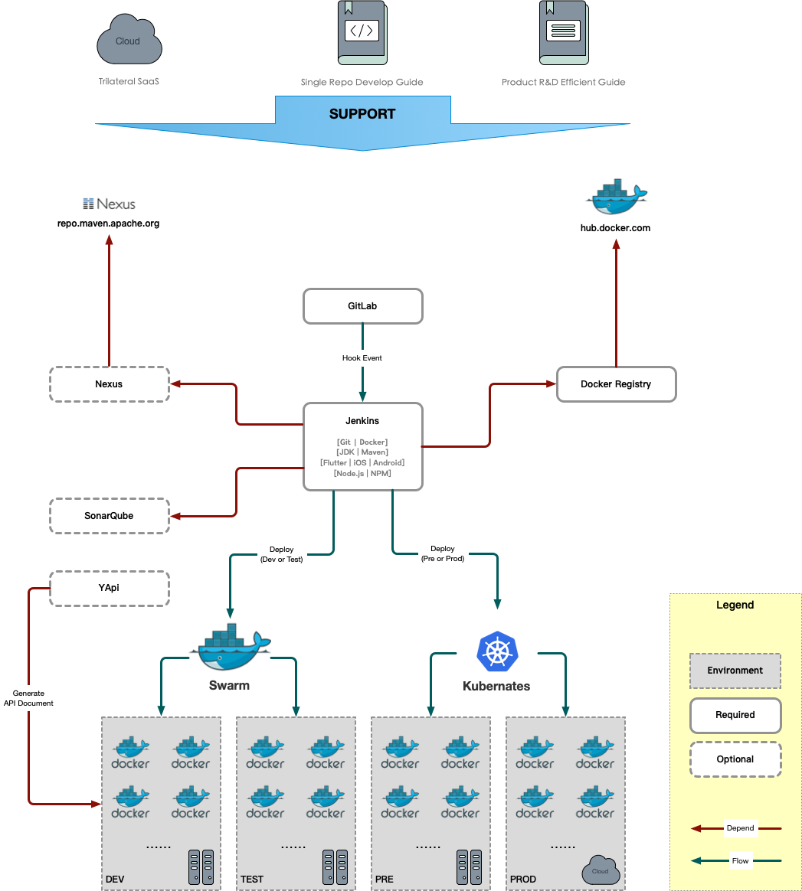
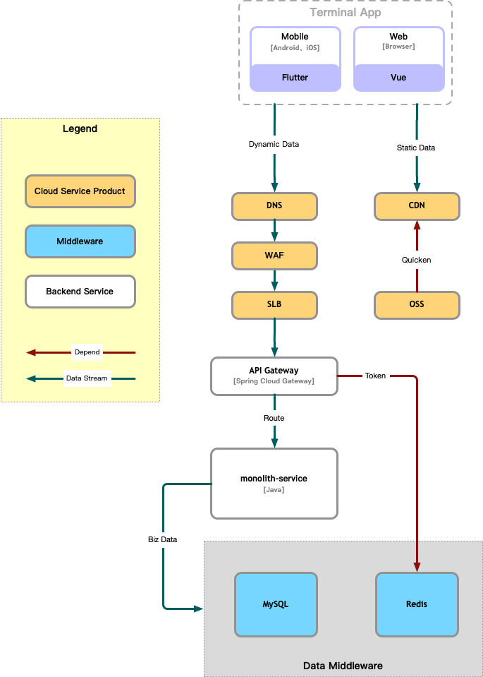
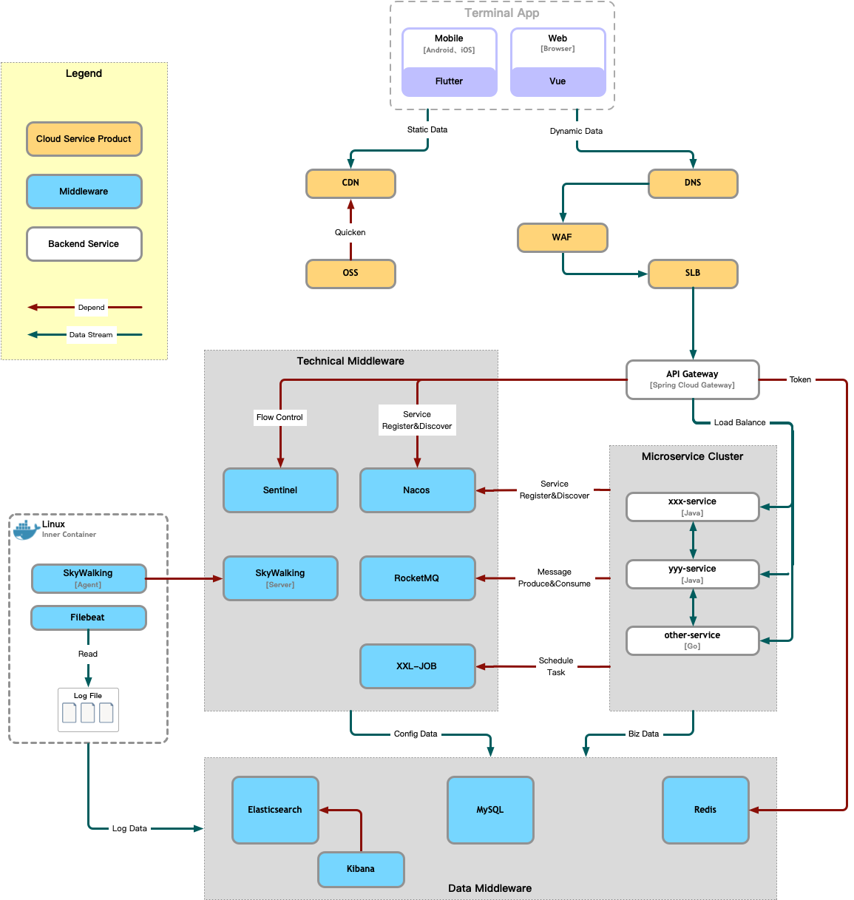

# EVLOVE

EVLOVE is an Internal Developer Platform(IDP) that focuses on the elegant evolution of technical architecture.

But it is not limited to the IDP, also a three-dimensional solution for the R&D team that integrates hard technology and soft mode.

Let's the evolution of technical architecture more elegant.

## Origin

**ORIGIN OF NAME**

EVLOVE [i:vlʌv] is a reverse word of 'evolve'. The meaning of "evolve" fits the central idea of this framework - the evolution of supporting technical architecture. And, Reversing 'evolve' is also a metaphor for the concept of evolutionary order.

The logo is designed as a mirror effect, with 'evlove' in the upper half and 'evolve' in the lower half.

Coincidence: EVLOVE = ev + love, the root word 'ev' represents "age, lifespan, era", and can also be interpreted as meanings such as "love with a sense of age" and "branding".

**ORIGIN OF THOUGHT**

Before 'EVLOVE', I had two technical frameworks of microservice architecture style applied to multiple commercial systems. Like the evolution of technical architecture, architectural ideas, R&D patterns, and continuous integration are also evolving simultaneously:

- **KITCHEN**

  In 2017, when the concept of microservices just become popular (everyone just started to try the immature SpringCloud and the distributed system based on Dubbo was maturely applied in large companies but didn't fit the concept of microservices). I sorted out some patterns accumulated in the single architecture before, and tried to integrate them with the concept of microservice, based on SpringBoot, Netty, Docker, and other technologies, I built a communication base by myself and created a technical pedestal of microservice architecture style.

  Based on the KITCHEN technical pedestal, supports the transformation of commercial smart TV products from a single architecture style to a microservice architecture style.

- **MASSLESS**

  After two years of development, the microservice architecture based on the Spring Cloud ecology has gradually become popular. Therefore, in 2019, I gave up the maintenance of the KITCHEN and turned to embrace Spring Cloud ecology. During this period, I also experienced the suspension of the Netflix suite and gradually turned to the process of the Alibaba suite.

  Therefore, based on the idea of KITCHEN, combined with Alibaba's experience, concepts such as DevOps, single Repo development, and R&D efficiency improvement were integrated, and the MASSLESS framework gradually evolved. This stage is more about the in-depth application of the microservice architecture style and the precipitation and sorting out of the R&D pattern.

  Based on the MASSLESS framework, it has created an Internet education platform that accommodates tens of millions of users, nearly one million daily active users, and high business complexity. It also presents the advantages of the microservice architecture style and R&D pattern to products and teams.

- **EVLOVE**

  EVLOVE is a further optimization based on the KITCHEN and MASSLESS frameworks. It focuses more on how to gracefully evolve the architecture during the long process of the product from the 0-1 stage and the 1-N stage. Satisfying the use of appropriate technical architecture for products at different development stages, give full play to the benefits that the technical architecture can bring, while avoiding large-scale reconstruction caused by the evolution and change of the technical architecture. 

  From the perspective of the development model, technical architecture, and engineering structure, it reduces the adaptation curve of developers and continuously accumulates code assets.

  After accumulating several product creation processes, EVLOVE will also provide more highly abstracted technical and business components for the framework users to quickly access the corresponding capabilities.

The higher the degree of adaptation between the technical architecture and the R&D pattern, the better the team can achieve good results in the long-term product R&D process. 

Reading my related articles (in Chinese) is more conducive to understanding the architectural ideas of the framework:

- [*Internet Product R&D Pattern And Efficiency Improvement Guide*](https://massaton.github.io/2020/01/14/developer/manage/mode-and-efficiency-guide/1-introduction/index/) **Series**
- [*Single Repo Development Mode*](https://massaton.github.io/2020/03/02/developer/manage/single-repo-dev-mode/index/)

## Aims & Features

- Provide a set of the technology development platform.
- Provide a set of development patterns.
- Provide a set of R&D management patterns.
- Integrating concepts such as "IDP", "R&D pattern", "Efficiency management" and "DevOps", it provides a three-dimensional solution for the R&D team.
- Satisfy the elegant evolution of the technical architecture throughout the product development process (from the single technical architecture of the 0-1 stage to the microservice architecture of the 1-N stage).
- To satisfy developers' basic needs in the entire R&D life cycle of Internet products, developers can focus more on business and other interesting things.
- Build on new era (revolutionary big version) technology stacks (Java 17+, SpringBoot 3+, SpringCloud 2022+, Dart 3+, Flutter 3+, Vue 3+), try out their new features, and possibly appropriate encapsulation based on the idea of EVLOVE.
- During the evolution of technical architecture, there is no need for refactoring the project structure.
- During the evolution of technical architecture, the technology stack has continuity and scalability.
- During the evolution of technical architecture, continuous integration has no impact.
- The development mode (single repo development mode) is not affected by the evolution of the technical architecture.
- Provide universal, highly abstract technical capabilities and basic business capabilities.
- Under the microservice architecture, while maintaining (maybe slightly reducing) the relationship with the Alibaba suite (stability verified by a large number of users and large-scale clusters), embrace the international technology stack trend.
- The development platform reduces the sense of existence as much as possible, and only appears when needed, and conforms to the development logic and way of thinking of most people.
- Improve development efficiency, reduce development difficulty, and provide modular tools and ideas without affecting flexibility.

## Business Architecture

**TECHNICAL ABILITY**

- The basic capabilities of service layer services (templated services). It only needs to care about the implementation of business code, and other aspects are supported by specifications or tools.
- Provide API-oriented access security control capabilities in Spring Cloud Gateway.
- Anti-repeat submission capability (different from anti-replay attack in access security control). Support global (Non-GET request) and set a specific interface through annotations.
- Cache capability — Encapsulate Lettuce to operate the first-level cache, integrate Redis to operate the second-level cache, and use JetCache to provide different levels and granularity of cache control methods to meet various cache scenes.
- Relational data capability — By integrating MySQL to support storage, the ORM framework uses MyBatis.
- Code generation capability — Provide basic code generation based on data structure through IDEA plug-ins (MyBatisX or EasyCode).
- Service registry center — Provided by Nacos.
- Service configuration center — Provided by Nacos.
- Event-driven capability — Provided by integrating RocketMQ
- Distributed transaction capability — By integrating RocketMQ, using 'Transactioinal Message' to ensure the final consistency of data.
- Distributed task scheduling capability — Provided by integrating XXL-JOB.
- Search engine and Log analysis — Provided by integrating Elasticsearch, Kibana, Filebeat.
- Mobile application development capabilities — Provided through the Flutter framework, and provide core application rapid development capabilities through abstraction and encapsulation.
- Web application development capabilities — Provided through Vue.js and Element UI component libraries.
- CI and CD capabilities — Provided through the DevOps suite (GitLab + Jenkins + Docker + Kubernates).
- Full link log tracking.
- Full link performance monitoring — Provided by integrating SkyWalking.

**BUSINESS ABILITY**

- General service — RBAC
- General service — Dictionary&Parameter
- General service — APP version control
- General service — Versioned Manual & Protocol Management
- General service — Universal ad management (Multi-modal, Multi-position)
- User Profile & Tag Engine
- Requirements development model — Provided through *Efficiency Improvement Guide* and *Single Repo Development Model*.

==TODO Keep replenishing.....==

## Technology Stack

EVLOVE has adopted a revolutionary large version on the core technology stack.

The role of the main technology stack and the reasons for its selection are as follows:

**Frontend**

- **Flutter 3+:** As the main framework supporting the development of mobile apps, it can complete the development of Android and iOS dual systems consistent with native effects based on Flutter. And can also use native development conveniently and flexibly to supplement the capabilities of the framework or components. In addition, Flutter's performance in the big front-end on-stop technology stack is also remarkable, and it can use a set of frameworks to meet the development of desktop, web, mobile, and embedded platforms at the same time.
- **Vue.js 3+:** As the main framework supporting the development of webpage apps, it meets the development of websites and mobile-side web pages. It is very popular among front-end developers in China and the popular component library or middle-background framework is also based on Vue.js, and the overall ecological development is relatively comprehensive and healthy.

**Backend**

- **Java 17+:** As the main development language supporting the backend, version 17 is the latest long-term maintenance version of Java, and it is the minimum required version of Java for the revolutionary version of Spring. When virtual threads (coroutines) are officially released and mature, may consider upgrading the Java version again.
- **Spring Framework 6+ and Spring Boot 3+:** As the main framework supporting backend development, it provides most of the basic capabilities and code libraries for developing server-side applications.
- **Spring Cloud 2022+:** As the technical base of the backend service layer supporting the microservice architecture style, it provides the integration of the basic capabilities/components (Proxy, Load Balance, Gateway...) required for the development of microservices.
- **Spring Cloud Alibaba 2022+:** As a core middleware integration solution supporting the microservice architecture style, it provides the integration of core distributed capabilities/middleware (Registry, Config, Fault tolerance) and enhances distributed capabilities/middleware (MQ, Distributed transaction) required by microservices.
- **GoLang:** Because under the microservice architecture style, the backend service layer has a high tolerance for the implementation language. As a popular server-side programming language, Go will also be one of the languages used by EVLOVE to implement backend services, but it will only provide a basic example to demonstrate integration into the framework.

**Middleware**

- **MySQL 8+:** As the main component for storing relational data, it can flexibly evolve from a single-cluster multi-database to a multi-cluster single-database during the development of data volume and access volume. At the same time, it also supports the processing of unstructured data and can replace NoSQL at a specific stage to provide corresponding capabilities.
- **Redis 7+:** It mainly provides mature cache support for data with high access delay requirements or temporary data (such as user Token), and can also support scenes such as distributed locks, simply distributed transactions, and simply event-driven. It is also a dependent component of framework capabilities such as "API Access Security Control", "Anti-Duplicate Submission", and "RBAC".
- **NACOS 2+:** In the microservice mode, it provides the support of the service registration center and configuration center.
- **Elasticsearch 8+ (Enhance):** It is used to support log storage analysis, full-text search, and other scenes that require the search and analysis of large-scale data. In the 0-1 stage of product development, MySQL and local files can be used to replace ES to support relevant scenes. In the 1-N stage, relevant scenes can be migrated to professional search and analysis middleware for more refined optimization and higher performance.
- **RocketMQ 5+  (Enhance):** It is used to support scenes such as event-driven, asynchronous decoupling, and peak-shaving & valley-filling. In the 0-1 stage of product development, it can be replaced by other components. In the 1-N stage, relevant scenes can be migrated to professional MQ middleware at an appropriate time to provide support with stronger functions and better performance.
- **Sentinel 1.8+ (Enhance):** For products whose number of users has grown to a certain scale, this middleware is enabled in the gateway to support various flow protection control scenes and prevent "avalanche". In the early or middle stages of product development, other components can be used to support related scenes (For example, RocketMQ, timeout & exception handling mechanisms can satisfy scenes such as flow control, fusing & downgrading to a certain extent).
- **XXL-JOB 2.3+ (Enhance):** It is used to support batch-processing scenes such as batch-processing data and scheduled tasks. In the early or middle stage of product development, it can be supported by "local schedule + distributed lock" or "MQ timing message". With the increase in task volume, data volume, and complexity, distributed task scheduling middleware can be enabled, and its fragmentation processing mechanism can also be applied to improve the performance of task processing.
- **SkyWalking 9+ (Enhance):** Provide full-link application performance management and analysis capabilities (APM). It is enabled when the user scale or business complexity develops to a higher scale to improve the ability to locate performance bottlenecks.
- ~~**Seata :** Using RocketMQ's event messages is enough to support most distributed transaction scenes.~~ 

**Other**

- **Git:** Provide management and version control of product-related code.
- **GitLab:** It is used to support the scenario when the code warehouse is deployed in the local computer room, and apply its Issues, Boards, Webhooks, and other functions to support the R&D pattern and CICD pipeline.
- **YApi:** Combined with Swagger, it provides support for the automatic generation of interface documents, mock interfaces, interface testing, and other scenes, improving communication and testing efficiency.
- **SonarQube:** Integrate it into the CICD pipeline to statically check the code of the product to improve code quality.
- **Nexus:** Through NEXUS' self-built Maven and NPM package management warehouses, it supports the management of its own project module compilation packages.
- **Maven:** It supports the construction of Java projects, dependencies, and management of compiled packages. Compared with Gradle, its usage rate is higher, and it is more in line with the development habits of most Java developers.
- **Jenkins:** The core component that supports the CICD pipeline, defines and schedules the entire pipeline, and is less coupled with the engineering code, separating the responsibilities of code development and CICD.
- **Docker:** It is used to package the project deployed on the server into a container to support the rapid distribution of products in various environments.
- **Docker Registry:** It is used when the image warehouse is deployed in the local computer room.
- **Docker Compose:** It is mainly used to deploy middleware in non-production environments.
- **Swarm:** It is mainly used for service deployment and governance of the development environment and the test environment. When there are multiple environments and a large number of services, it can effectively improve the governance efficiency of the service layer.
- **Kubernetes:** It is mainly used for service deployment and governance in pre-production and production environments. When there are multiple environments and a large number of services, it can effectively improve the governance efficiency of the service layer.

**Style**

- **Monolithic Architecture:** The back-end service can be constructed as a single service to reduce the complexity of the technical architecture, thereby improving the development efficiency of the 0-1 stage of the product. Basic capabilities such as RBAC and security control can be obtained by inheriting the relevant ABILITY projects preset by EVLOVE without porting code.
- **Microservice/Distributed Architecture:** Support the product in the 1-N stage, in order to meet various non-functional requirements and improve the architectural style of the comprehensive capability of the technology platform.
- **Separation of Frontend and Backend:** The Frontend and Backend technology stacks are independent, the engineering code is decoupled, the engineering structure is clearer, and it is easy to optimize, manage and evolve by division.
- **Single Repo Development:** Put all the projects of the product into one code warehouse, and equip them with construction, structure, and CICD conventions to reduce engineering complexity and thus improve R&D efficiency.
- **DevOps:** The main purpose is to reduce worthless and repetitive work, reduce possible problems in manual operations, and free up more energy to focus on business development and technology evolution.
- **Agile development:** Through the "*[Improving R&D Efficiency Guide]()*", agree on the collaboration mechanism of the team, guide the handling of non-technical issues in the R&D process, and improve R&D efficiency.

*Note: While the framework technology stack maintains the relationship with the Spring Cloud Alibaba microservice suite, it will also take due account of international mainstream technology trends and try some new technologies to solve specific fields.*

## Technical Architecture Schematic

It only indicates the situation of start-up Internet products, and the specific components and specifications depend on the actual situation.

### DevOps

In the 0-1 stage, the system is usually complete development through one large iteration or several medium-sized iterations. If when the development of a monolithic architecture is adopted at the same time, the demand for service governance is not great, and when the conditions (time, energy, personnel) are tight, you can simplify it according to your own situation. 

After the 0-1 stage is completed, gradually complete the construction of the DevOps suite so that it can play its greatest role in the rapid iteration of the 1-N stage.

### 0-1 Stage (Monolithic Architecture)

Monolith only means that the engineering structure of the service layer is monolithic, and all services are coupled in the same service instance. In order to ensure the high availability of services or performance considerations, more than two instances will be deployed on the server side to form a cluster. From the perspective of the system as a whole, it is still a distributed architecture system composed of data middleware, gateways, cloud services, and other systems/components.

At this stage, there is no need to care about service architecture, sub-database, or distributed complex scenarios (transactions, inter-service calls), service governance, etc. A simple technical architecture can speed up the 0-1 process and complete the product online as soon as possible verification. However, depending on the actual situation of the business and the team, some other technologies may still be used at this stage, such as MQ-based event-driven, execution of timing or event tasks based on distributed task scheduling, and lightweight big data processing components (such as Elasticsearch) etc.

In order to speed up the launch, the non-functional requirements are usually not important and urgent at this stage, and the complexity of the technical architecture should not be increased as much as possible. Finding a fast and low-complexity solution can effectively reduce the product development cycle. For example, using Elasticsearch for full-text search is the optimal solution, but using the NoSQL capabilities provided by MySQL 8 can meet current needs. For another example, event-driven or timed tasks can decouple business very well, introducing MQ middleware is the best solution, but it can also be solved by using @Async+Redis subscription mode or @Scheduled+Redis lock. At this time, it should be weighed whether introducing new technical middleware and increasing the complexity of the technical architecture bring pros and cons at this stage.

Although the gateway is a component under the microservice architecture style, the gateway provides some security control capabilities, and this capability runs through the product growth. The gateway is introduced in the monomer stage, and some common capabilities are solved in the gateway. Monolithic services can be more focused on business implementation, which is also conducive to the evolution of the technical architecture to the next stage.

### 1-N Stage (Microservice Architecture)

With the development of products, business complexity, user volume, and team size rise to a certain level. At this stage, more attention should be paid to non-functional requirements such as performance, stability, flexibility, and complexity reduction. All aspects of business and technology are also developing in a more refined direction. Thereby, the technical architecture has gradually evolved into a microservice architecture style.

## Project Directory Structure

EVLOVE adopts the "single-repo project structure" to support the "single-repo development pattern" and the evolution of the architectural style from monomer to microservice:

- **@devops:** [Directory] -- Store DevOps suites, middleware, k8s deployment scripts, SQL scripts, and container data required for framework demonstrations.
- **@doc:** [Directory] -- Documents such as instructions and experience summaries related to the use of the framework are stored.
- **backend:** [Directory] -- General catalog of backend projects.
  - **common:** [Directory] -- The general catalog of each module that abstracts and encapsulates the "development capability" of the backend service, and provides various basic dependencies of the backend project.
  - **example:** [Directory] -- A general catalog of sample demo projects for framework capabilities or core scenarios.
  - **gateway:** [Module] -- Gateway project.
  - **microservices:** [Directory] -- General catalog of backend service layer projects.
    - **layer-app:** [Directory] -- General catalog of application domain service layer (facing the foreground application).
    - **layer-manage:** [Directory] -- General catalog of management domain service layer (facing the background application).
    - **layer-mid:** [Directory]  -- General catalog of public/share domain service layer (middle planform application)
    - **template:** [Module] -- The template of the Java microservice project, which is convenient and quick to create a microservice project.
    - **template-go:** [Module] -- The template of the Go microservice project, is only used to demonstrate how the Go language creates microservices in EVLOVE.
  - **monolith:** [Module] -- Monolithic service, used in 0-1 stage, relies on some technical capabilities in 'common', and can also obtain general business capabilities by relying on the project in 'layer-mid'.
- **frontend:** [Directory] -- General catalog of frontend projects
  - **app:** [Module] -- Mobile application project, the basic framework of mobile APP project based on the Flutter technology stack.
  - **oms:** [Module] -- Background application on the web (Operation Management System), a basic framework based on the Vue technology stack.
  - **official-website:** [Module] -- Website project example based on the Flutter technology stack.
- **microsoft:** [Directory] -- Store some small software and small tools, such as "efficiency analysis based on GitLab", "API call statistics", etc.
- **cicd.sh:** [File] Unified scheduling of differential compilation and deployment, is the entry script of CICD.
- **docker-stack.yaml:** [File] -- Docker Swarm scripts, server-side project compilation relies on this script to process images, and development and test environment deployment rely on this script to deploy through Swarm.

## Address & Account
- **Swagger**
  - Address: http://server:port/context-path/v3/api-docs